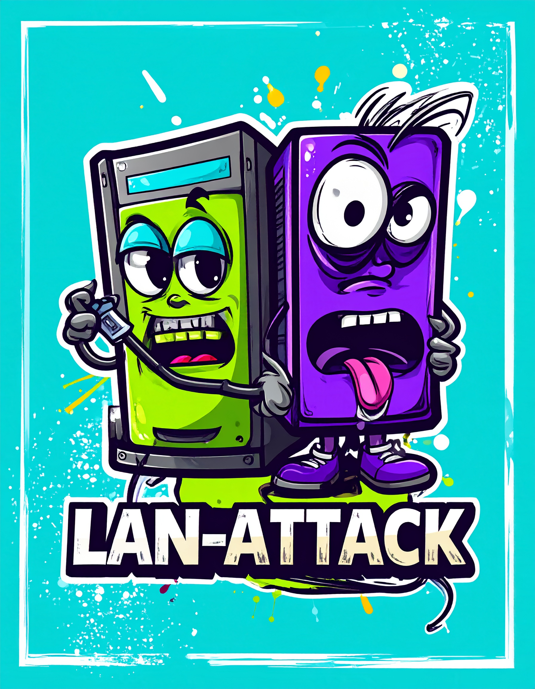

  
   
  <strong>RatShell-LAN Attack</strong>

**SYNOPSIS**

LAN Toolset in Powershell Including File-Server, Screenshare and Reverse PS Shell, all over HTTP. 

Starts a HTTP server on the machine, open on port 8080.   

**USAGE**
1. Run the Script or stager on the target computer
2. Click 'yes' on the UAC prompt to allow script to run as Admin
3. Allow 10 seconds for setup then select an option
4. On another device on the same network, open a browser window and type the given IP address (Shown in setup window)

<h3>Why?</h3>
Transfer files, control the computer, view the screen on another device..

<h3>How?</h3>

1. Checks for Admin and restarts script
2. Opens firewall to incoming requests on port 8080
3. Sets folder as the folder the script/stager starts in
4. Defines Functions for options
5. Prompts the user to enter an option
6. Starts the webpage on the machine ip address

<h3>FAQ</h3>

1. Why admin? - Needed for opening ports in Windows firewall
2. Can the script be killed from the browser? - Yes.
3. Future Updates? - Coming soon.

<h3>TODO</h3>

1. Provide FlipperZero/RubberDucky script for deploying LAN-Attack
2. Improve README.
3. Add more functions
